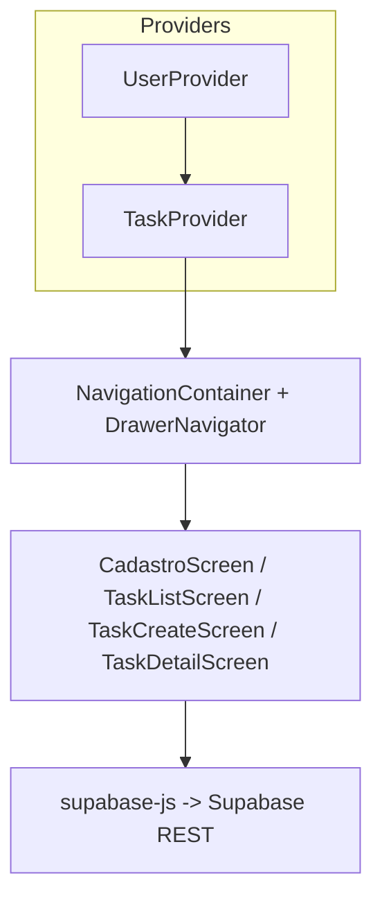
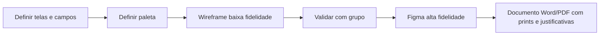

# PDM Tarefas — Documento de Design

App mobile (React Native / Expo) para gerenciamento de tarefas pessoais, com cadastro de usuário, listagem com filtros, criação e visualização de detalhes. Backend em Supabase.

> Este documento é a base para o protótipo no Figma e para a entrega em Word/PDF: ele descreve as 4 telas, o padrão de cores e as justificativas de design.

## 1. Paleta de cores

| Token         | Hex       | Uso                                     | Justificativa                                                                 |
| ------------- | --------- | --------------------------------------- | ----------------------------------------------------------------------------- |
| `primary`     | `#4F46E5` | Header, Drawer, botões principais       | Indigo transmite foco, produtividade e confiança — alinhado a apps de tarefa. |
| `primaryDark` | `#3730A3` | Estado pressionado, ícones ativos       | Contraste suficiente sem perder identidade.                                   |
| `secondary`   | `#10B981` | Confirmação, status “concluída”         | Verde universalmente associado a sucesso/conclusão.                           |
| `warning`     | `#F59E0B` | Prioridade alta / em andamento          | Âmbar chama atenção sem assustar como vermelho puro.                          |
| `error`       | `#EF4444` | Erros de validação e prioridade crítica | Vermelho saturado, alto contraste para feedback negativo.                     |
| `background`  | `#F8FAFC` | Fundo de tela                           | Cinza muito claro reduz fadiga visual.                                        |
| `surface`     | `#FFFFFF` | Cards, inputs                           | Hierarquia clara sobre o fundo.                                               |
| `text`        | `#1E293B` | Texto principal                         | Próximo de preto, mas mais quente — melhor leitura.                           |
| `textMuted`   | `#64748B` | Subtítulos, placeholders                | Hierarquia tipográfica sem competir com o conteúdo.                           |
| `border`      | `#E2E8F0` | Bordas de inputs e cards                | Delimita áreas de toque mantendo visual limpo.                                |

Princípios visuais:

- Espaçamento generoso (`padding 16–20`) e cantos arredondados (`10–12`) para sensação amigável.
- Áreas de toque com altura mínima de 48px (acessibilidade — WCAG / Material).
- Tipografia em pesos `400/600/700` para escala clara entre corpo, rótulos e títulos.

## 2. Telas e funcionalidades

### Tela 1 — Cadastro de Usuário (obrigatória)

Rota Drawer: `Cadastro`. API: `POST /usuarios`.

| Componente              | Função                                | Obrigatório | Validação                       |
| ----------------------- | ------------------------------------- | ----------- | ------------------------------- |
| `FormTextInput` nome    | Nome completo                         | Sim         | mínimo 3 caracteres             |
| `FormTextInput` email   | E-mail                                | Sim         | formato e-mail válido           |
| `FormTextInput` telefone| Telefone (apenas dígitos)             | Não         | 10 a 11 dígitos                 |
| `FormTextInput` senha   | Senha                                 | Sim         | mínimo 6 caracteres             |
| `FormTextInput` confirmar | Confirmação de senha                | Sim         | igual à senha                   |
| `PrimaryButton` Cadastrar | Envia o formulário                  | —           | desabilitado se inválido        |
| Mensagens de erro       | Feedback por campo                    | —           | Formik + Yup                    |
| `ActivityIndicator`     | Loading durante POST                  | —           | —                               |
| Texto de erro de API    | Falha de rede / Supabase              | —           | try/catch + mensagem amigável   |

Justificativa: foco em um único objetivo (cadastrar). Inputs empilhados com labels visíveis (princípio de Nielsen — visibilidade do status). Botão primário fixo abaixo dos campos.

### Tela 2 — Lista de Tarefas

Rota Drawer: `Tarefas`. API: `GET /tarefas?usuario_id=eq.{id}` + filtro local.

| Componente              | Função                                                            |
| ----------------------- | ----------------------------------------------------------------- |
| `PickerField` status    | Filtra: Todos / Pendente / Em andamento / Concluída               |
| `PickerField` prioridade| Filtra: Todas / Baixa / Média / Alta                              |
| `FlatList`              | Renderiza lista virtualizada de cards                             |
| `TaskCard`              | Mostra título, data, status (tag colorida) e prioridade (tag)     |
| `RefreshControl`        | Pull-to-refresh para recarregar do Supabase                       |
| `EmptyState`            | Mensagem quando a lista filtrada está vazia                       |
| `PrimaryButton` flutuante | Atalho para “Nova tarefa”                                       |
| Tap em card             | Navega para `DetalheTarefa` passando `{ taskId }` (passagem direta)|

Justificativa: dois filtros independentes cobrem os recortes mais comuns. Tags coloridas codificam status/prioridade visualmente.

### Tela 3 — Nova Tarefa

Rota Drawer: `NovaTarefa`. API: `POST /tarefas`.

| Componente               | Função                              | Obrigatório            |
| ------------------------ | ----------------------------------- | ---------------------- |
| `FormTextInput` titulo   | Nome da tarefa                      | Sim                    |
| `FormTextInput` descricao| Detalhes (multiline)                | Não                    |
| `PickerField` status     | pendente / em_andamento / concluida | Sim (default pendente) |
| `PickerField` prioridade | baixa / media / alta                | Sim (default media)    |
| `PrimaryButton` Salvar   | `POST` em `tarefas`                 | —                      |

`usuarioId` vem do `UserContext` (passagem **indireta** — sem `route.params`).

### Tela 4 — Detalhe da Tarefa

Rota oculta no Drawer: `DetalheTarefa`. Acesso só por navegação a partir do card.

| Elemento                    | Função                                                           |
| --------------------------- | ---------------------------------------------------------------- |
| `const { taskId } = route.params` | Recebe o id por desestruturação (passagem **direta**)     |
| Cabeçalho                   | Título da tarefa e data                                          |
| Tags coloridas              | Status e prioridade                                              |
| Descrição                   | Texto completo (ou “Sem descrição”)                              |
| `PrimaryButton` Voltar      | `navigation.goBack()`                                            |

## 3. Arquitetura e padrões

- Drawer customizado: header com identidade visual, item ativo destacado em `#EEF2FF`, botão “Sair” no rodapé quando há usuário.
- `ErrorBoundary` ao redor de toda a app para evitar tela branca em caso de erro.
- Componentização: cada componente em pasta própria com `index.js` + `styles.js` (atende ao requisito).

## 4. Fluxo de validação com o grupo

## 5. Como montar o protótipo no Figma

1. Criar arquivo em [figma.com](https://www.figma.com/) com frame mobile **390×844** (iPhone 14).
2. Definir Color Styles usando a paleta da seção 1.
3. Criar 4 frames (um por tela) seguindo as descrições acima.
4. Componentes reutilizáveis (Components): `Input`, `ButtonPrimary`, `TaskCard`, `Tag` (com variantes por cor), `DrawerItem`.
5. Exportar cada frame em PNG e montar o documento Word/PDF, com uma seção por tela contendo:
   - Print do frame.
   - Tabela campo × função × validação (use as desta página).
   - Justificativa de cores e layout.
